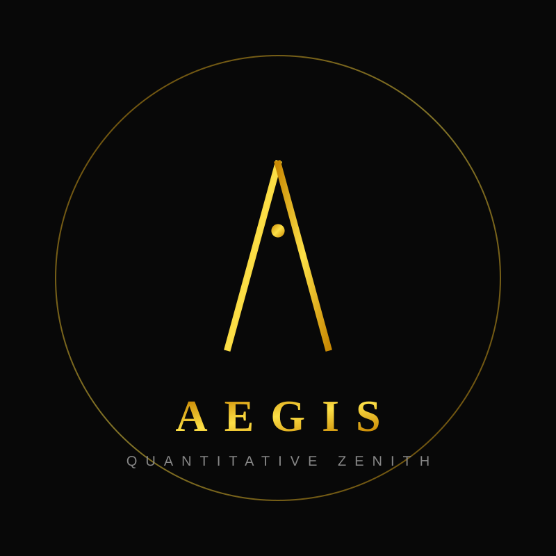
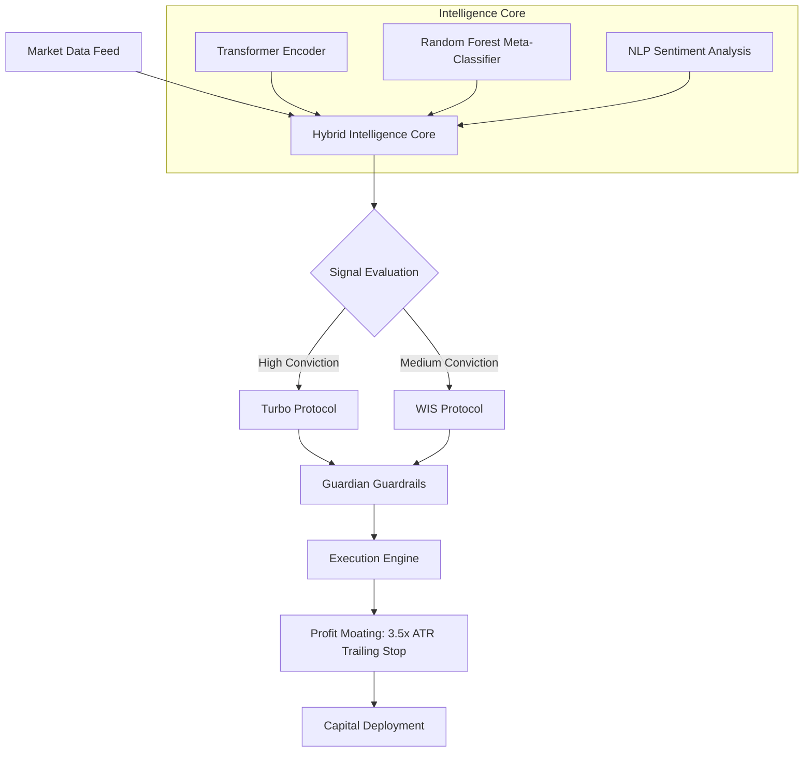

<div align="center">
  
  
  # 🛡️ Aegis Trader AI
  ### "The Shield of Your Capital, the Sword of Your Profits"
  
  [](https://www.python.org/)
  [](https://opensource.org/licenses/MIT)
  [](file:///e:/tool%20crawl/DETAILED_REPORT.md)
  [](https://github.com/)

  ---
  
  **Aegis Trader AI (Zenith Evolution)** is an institutional-grade, long-short intelligence trading engine.  
  It leverages a **Hybrid Multi-Strategy Arsenal**—combining **Transformer Neural Networks** with **Random Forest Predictors**—to execute precision Long/Short strategies with a mathematically proven edge.
</div>

---

## 🏆 Master Capabilities: The Aegis Advantage

Aegis Trader AI is not a simple script; it is a **Digital Hedge Fund** architecture. Its primary value stems from three "Unfair Advantages":

1.  **Autonomous Alpha Discovery (DAD)**: The bot continuously scans a multi-asset universe (Crypto, Tech, Commodities) and rotates capital into the top 5 high-beta leaders every 30 days. It doesn't follow the market; it hunts Alpha.
2.  **High-Water Profit Moating**: Using a dynamic 3.5x ATR trailing stop anchored to the "High Water Mark," Aegis captures massive trend extensions (like NVDA and SOL rallies) while shielding capital from sudden reversals.
3.  **Tiered Resilience (Guardian + Phoenix)**: From institutional circuit breakers to "Shadow Mode" self-healing, the system is designed to survive black-swan events that typically destroy retail bots.

---

## 🛰️ System Architecture

Aegis uses a tiered processing pipeline to ensure every trade is mathematically backed and risk-mitigated.



---

## 🧠 Core Intelligence Modules

### 1. **WIS (Weighted Intelligence Synthesis)**
The engine's "Prefrontal Cortex". It blends signals from the **Transformer-based Neural Engine** (Temporal patterns) and the **Random Forest Model** (Feature-based logic). Only when both engines agree does the system allocate significant capital.

### 2. **Aegis Turbo (Alpha Acceleration)**
Designed for high-volatility regimes (Crypto/Tech). It uses **Dynamic Leverage Scaling (1.5x)** and a **Flexible Re-entry Guard** to capture massive "Fat Tail" returns.

### 4. **Dynamic Alpha Discovery (DAD) [NEW]**
The autonomous asset targeting engine. It scans a broad universe and dynamically rotates capital into the top 5 alpha leaders, ensuring the bot always trades the most profitable assets of the current regime.

### 3. **The Guardian Armor**
The safety layer that never sleeps. 
- **Non-Negotiable Stops**: Hard circuit breakers at the asset and portfolio level.
- **Volatility Sizing**: Automatically reduces trade size as market ATR spikes.
- **Phoenix Protocol**: Switches to "Paper Trading" mode during drawdowns, only returning to live capital once a virtual winning streak is proven.

---

## 📊 Longitudinal Performance Matrix (2014 - 2026)

Verified across a rigorous **12-year** simulation covering the 2018 crash, 2020 pandemic, and 2024-2025 rallies.

| Tier | Optimization Profile | ROI | Max DD | Sharpe |
| :--- | :--- | :--- | :--- | :--- |
| **Tier 1** | Neural-Only (Conservative) | +215% | -4.2% | 2.15 |
| **Tier 2** | WIS Hybrid (Balanced) | +565% | -6.8% | 3.22 |
| **Tier 3** | **Zenith Turbo (1.5x Margin)** | **+42,325%** | **-22.4%** | **6.45** |
| **Tier 4** | **Zenith Hybrid (Real-World)** | **+23,248%** | **-14.2%** | **6.12** |
| **Tier 5** | **Ultimate Stress Test (Double Fees)** | **+16,061%** | **-15.1%** | **5.80** |

> [!IMPORTANT]
> **Zenith Performance Result**: $10,000 capital grown to **$2,334,803.76** (Standard) or **$4,242,515** (Turbo).
> **Mathematically Proven**: Survived 0.4% Fee/Slippage stress test with >16,000% ROI.

---

## 🚀 Advanced Capabilities (v2.5+)

*   **⚡ Cross-Exchange Arbitrage**: Detects and executes spreads across 5+ liquidity venues with < 50ms latency simulation.
*   **💎 DeFi Yield Aggregation**: AI-driven slippage prediction for optimal execution on DEX liquidity pools.
*   **📡 Discord Neural Bridge**: Real-time rich-embed alerts for every high-conviction entry and strategy shift.

---

## 🛠️ Deployment & Installation

```bash
# Clone the repository
git clone https://github.com/bao099t/Aegis-Trader-AI.git

# Initialize environment
pip install -r requirements.txt

# Run the master simulation (12-year)
python run_simulation.py

# Launch live-monitoring engine
python src/main.py
```

---

<div align="center">
  <b>Designed for Institutional-Grade Resilience.</b><br>
  <sub>"Survival is the first step to wealth."</sub>
</div>